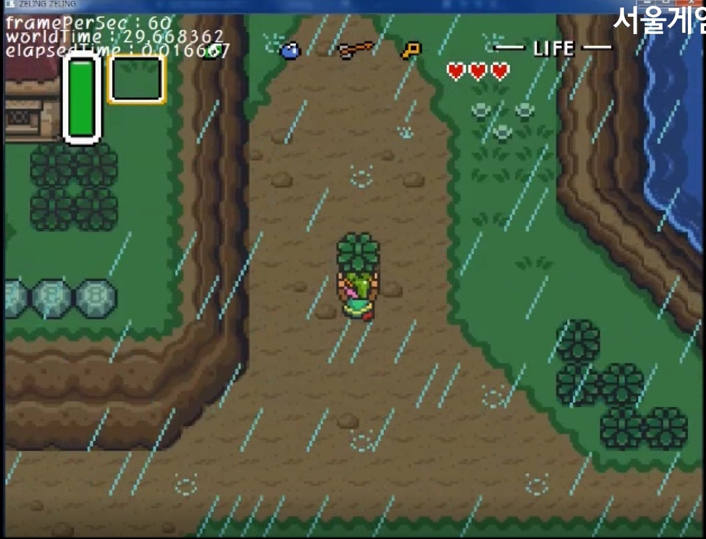

# Portfolio
  SampleGame, SampleLibrary, SampleServer.

* SampleGame  
  
  1. 젤다의 전설 모작   
     
  
  Windows API(GDI) 팀 포트폴리오   
   
    - 제작기간 : 1주일   
    - 담당 파트 : UI, 인벤토리   
  
  선택에 따라 인벤토리, 미니맵, 저장UI를 따로 출력.   
  UI 키 입력을 기다리고 있다가 키가 입력되면 본 게임 업데이트를 중지하고 UI만 업데이트하여 렌더.   
  UI화면으로 자연스럽게 전환되도록 화면비율에 따라 조금씩 스크롤 시킴.   
  입력받은 UI키가 월드맵이었다면 월드맵만 업데이트하도록 구현.   
  부분확대 및 방향키로 표시지역 변경 가능.   
  월드맵 이미지를 128층으로 나누어 각 층마다 조금씩 확대해 출력하는 기법으로 오목거울에 비친 것처럼 표현.   
   
    - 녹화영상 : https://youtu.be/FyDCROxhJNg   

  2. 디스가이아2 모작   
     
   
  Windows API(GDI) 팀 포트폴리오   
   
    - 제작기간 : 1주일   
    - 담당파트 : A*, 적 캐릭터, 아군 캐릭터   
   
  에너미, 플레이어 모두 파일명과 크기가 일정 양식에 맞춰 준비된 그림 파일을 읽어 종류에 따라 자동으로 분류 로드되게 구현.   
  외부에서 설정시킨 캐릭터 액션 상태값에 따라 캐릭터별로 업데이트 함수 실행결과가 달라지도록 구현.   
  캐릭터별로 설정된 이동가능거리에 따라 목적지가 될 수 있는 타일을 재귀적으로 수집.   
  수집된 타일 목록 내에서 A* 를 이용하여 이동가능 타일 경로 검색.   
   
    - 녹화영상 : https://youtu.be/FDuLjguT34E   

  3. 마비노기 영웅전 모작   
     
   
  DirectX 9 팀 포트폴리오   
   
    - 제작기간 : 4주일   
    - 담당파트 : 리소스 탐색 및 추출, 월드맵, NPC, 셰이더   
   
  구체에 텍스쳐를 입혀 스카이맵 구현.   
  DirectX9 기본 기능 이용.   
  Height map 기법으로 지형정보를 생성하고 건물 모델을 배치해 맵 완성.   
  그림자 매핑 방식으로 그림자 표현.   
  깊이버퍼의 데이터를 가져와 그림자 영역인지를 판정하고 하이트맵의 텍스쳐 rgb값을 조정.   
   
    - 녹화영상 : https://youtu.be/sx2sdj-TO7w   

* SampleLibrary   
  
  - Astar   
  A* 는 타일맵에 사용하는 길찾기 알고리즘이다. 주변의 이동가능한 타일을 검색하고, 각 타일에 대해 시작점으로부터의 거리와 목적지까지의 거리를 저장한 뒤, 두 거리값을 합한 값이 가장 작은 타일에 대해서 직전 단계의 타일이 어느 타일인지 기록해 두고, 다시 맨 처음의 작업부터 반복한다. 목적지에 도달하면 작업을 종료하고 기록해 둔 이전 단계의 타일 정보들을 모아 경로를 구성하는 식으로 작동한다.   
   
  - Breseham   
  브레슨햄 알고리즘은 픽셀 단위로 된 디지털 화면상에서 선을 적당히 보기좋게 그리기 위한 알고리즘이다. 특별히 어려운 부분은 없으나, 선의 양 끝점 처리와 경사를 주는 지점의 계산을 꼼꼼하게 처리해 주어야 예외없이 일정하고 예쁜 선이 나온다.   
  
  - DatabaseHandler   
  MySQL에서 제공하는 함수들을 이용해 데이터베이스를 좀더 편하게 다루기 위해 만든 데이터베이스 조작기이다. 외부 설정파일로부터 데이터베이스의 IP Address와 UserName, Password를 읽어와 접속하고, 쿼리를 보내고, 원치 않은 상황에 대해 오류메세지를 출력하는 기본적인 기능이 구현되어 있다.   
  멀티스레드용 버전은 기능은 같으나 TLS를 이용하여 여러 스레드가 동시에 데이터베이스를 조작해도 문제가 없도록 만든 것이다.   
   
  - GlobalHeader   
  이 라이브러리를 쓰기 위한 헤더파일들, 전역변수들, 열거체 및 구조체들을 모아둔 파트이다.   
   
  - JumpPointSearch   
  A* 를 기반으로 더 빠르게 경로를 찾는 알고리즘이다. A* 는 한 타일씩 경로를 찾았지만, 점프포인트 서치는 경로를 바꾸어야 하는 타일이 나올 때까지 묶어서 경로를 찾는다. A* 에서는 매 타일마다 하던 거리 계산을 꺾어가야 하는 지점에서만 하는 것이다.   
   
  - Log   
  서버의 로그를 남기기 위한 기본적인 기능을 구현하였다. 게임 내부 사항에 대한 기록과 서버 시스템 자체에 대한 기록을 파일로 남기거나 데이터베이스로 보낼 수 있다.   
   
  - MemoryAllocator   
  디버깅 시 메모리 할당과 해제가 실제로 똑바로 되고 있는지를 파악하기 위해 코드의 위치 등의 부가정보를 저장하도록 한 메모리 할당기이다. 여러 타입의 변수를 쓸 수 있도록 템플릿 함수를 이용했다.   
   
  - MemoryDumper   
  메모리 크래시 시 디버깅을 위한 덤프 파일을 생성하는 콜백함수들이다.   
   
  - Network   
  간단한 select, AsyncSelect, IOCP 서버의 코드를 주석으로 기록해 두었다.   
   
  - Parser   
  strtok을 이용하는 고전적인 파서이다. 파싱할 파일의 형식을 정하지 못하여 완전한 형태는 아니다.   

  - Profiler   
  개발에 사용한 프로파일러이다. 모니터링 서버에는 PDH프로파일러로 수집한 데이터를 보낸다.   
   
  - Queue   
  세션 별 송수신패킷을 저장할 때 쓰이는 큐들이다. 두 스레드가 각각 쓰기와 읽기만 한다면, 다시 말해 두 개 이상의 스레드가 동시에 쓰거나 읽지만 않도록 하면 안전하다.   
   
  - Stack   
  세션을 담아둘 스택들이다. 락 프리 링크드 스택은 여러 스레드가 동시에 Push와 Pop을 하더라도 안전하게 동작하며, (다른 스레드가 Push나 Pop을 하다 멈추었더라도)최소 하나의 스레드는 작업을 완료할 수 있다.   
   
  - Timer   
  업데이트 속도나 상태 출력 속도를 조절하기 위한 타이머.   
   
* SampleServer   
  자작 Windows IOCP 서버이다. 클라이언트, 데이터베이스 미포함.   
   
  1. IntegratedApplicationProject   
  LoginServer, ChatServer, MonitorServer 등을 포함한 연구 및 실습용 프로젝트.   
   
  2. MMO_Server   
  MMO게임을 위한 IOCP 서버이다. 락프리 링크드 스택 적용.   
     
     
      
   
  3. SilentNetworkLibrary   
  위의 프로젝트들에 사용한 라이브러리를 정적 라이브러리로 따로 만든 것.
