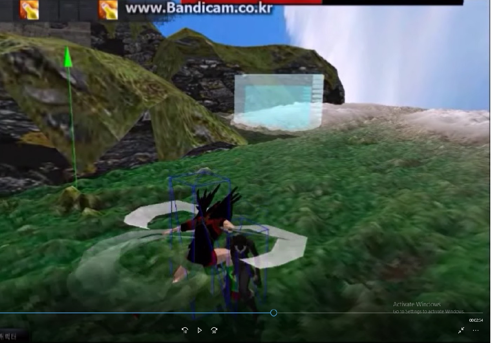

# Portfolio
  SampleGame, SampleLibrary, SampleServer.

* SampleGame  
  Custom single game. Resources are not mine. Original creators have the rights to resources for each game.  
  These games are the results of group work.
  
  1. Legend of zelda  
  
  https://youtu.be/FyDCROxhJNg

  2. Disgaea2  
   
   https://youtu.be/FDuLjguT34E
 
  3. Mabinogi Heroes  
   
   https://youtu.be/sx2sdj-TO7w

* SampleLibrary  
  Custom library. Excluded incomplete library from ./SampleServer/SilentNetworkLibrary.
  
* SampleServer  
  Custom Windows IOCP server. Client and database are not included.

  1. IntegratedApplicationProject  
  Project for practice and study. It contains LoginServer, ChatServer, MonitorServer, etc.

  2. MMO_Server  
  Game server for MMO. Lock-free linked stack for IOCP applied.  
  
  
   
  
  3. SilentNetworkLibrary  
  Static library used in the project above.
