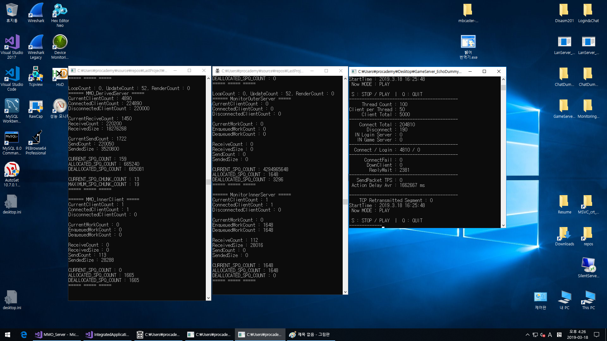

# Portfolio
  SampleGame, SampleLibrary, SampleServer.

* SampleGame  
  팀 포트폴리오 모작 젤다의 전설, 디스가이아2, 마비노기 영웅전이다.
  
  1 젤다의 전설 모작   
     
  
  Windows API(GDI) 팀 포트폴리오   
   
    ㅡ 제작기간 : 1주일   
    ㅡ 담당 파트 : UI, 인벤토리   
    ㅡ 녹화영상 : https://youtu.be/FyDCROxhJNg   

  2 디스가이아2 모작   
     
   
  Windows API(GDI) 팀 포트폴리오   
   
    ㅡ 제작기간 : 1주일   
    ㅡ 담당파트 : A*, 적 캐릭터, 아군 캐릭터   
    ㅡ 녹화영상 : https://youtu.be/FDuLjguT34E   

  3 마비노기 영웅전 모작   
     
   
  DirectX 9 팀 포트폴리오   
   
    ㅡ 제작기간 : 4주일   
    ㅡ 담당파트 : 리소스 탐색 및 추출, 월드맵, NPC, 셰이더   
    ㅡ 녹화영상 : https://youtu.be/sx2sdj-TO7w   

* SampleLibrary   
  DatabaseHandler, MemoryAllocator, MemoryDumper, Parser, Queue, Stack, Profiler, Timer 등의 서버 제작에 사용했던 라이브러리와 실습차 구현해 본 알고리즘들이다.   
  아래의 SilentNetworkLibrary에서 미완성인 것들만 제거한 것이다.
   
* SampleServer   
  자작 Windows IOCP 서버이다. 클라이언트, 데이터베이스 미포함.   
   
  1 IntegratedApplicationProject   
  LoginServer, ChatServer, MonitorServer 등을 포함한 연구 및 실습용 프로젝트.   
   
  2 MMO_Server   
  MMO게임을 위한 IOCP 서버이다. 락프리 링크드 스택 적용.   
     
     
      
   
  3 SilentNetworkLibrary   
  위의 프로젝트들에 사용한 라이브러리를 정적 라이브러리로 따로 만든 것.
